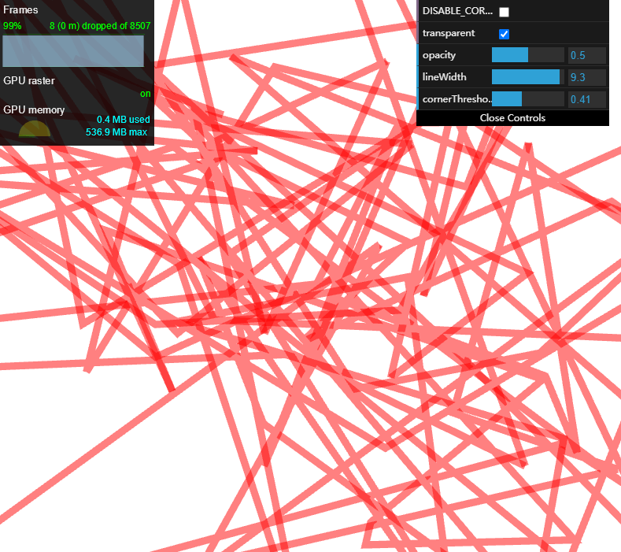

three.InstancedLine
===================

Instanced fat lines with miter joins. :thumbsup: Inspired by [spite/THREE.MeshLine](https://github.com/spite/THREE.MeshLine) and [three-fatline](https://github.com/mrdoob/three.js/tree/master/examples/js/lines).

* Optimized the storage of the vertex buffer, saving memory.
* Handle corners more smartly. If the corner is too small, break the corner to avoid sharp corners.



### Usage

````
const line = new THREE.InstancedLine();
line.material.lineWidth = 5;
line.material.transparent = true;
line.material.opacity = 0.5;
line.material.color.setRGB(1, 0, 0);
line.geometry.setFromPoints(points);
scene.add(line);
````
